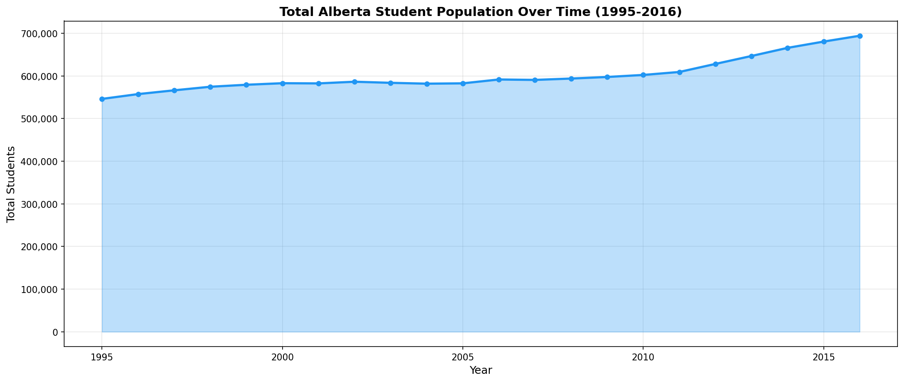
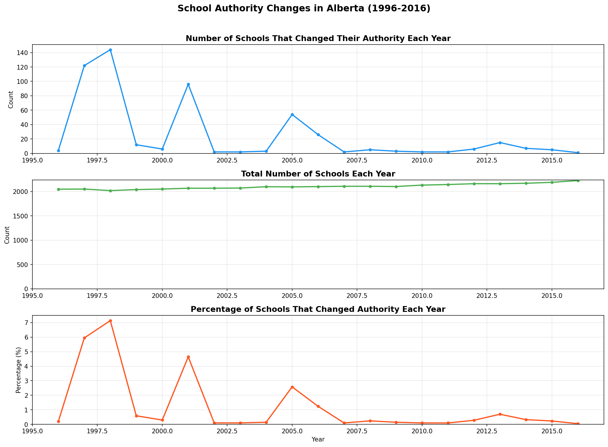
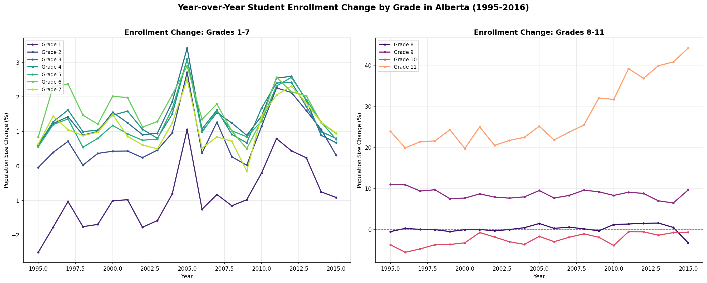
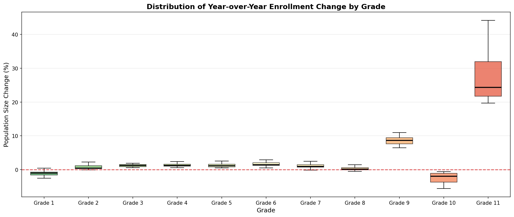
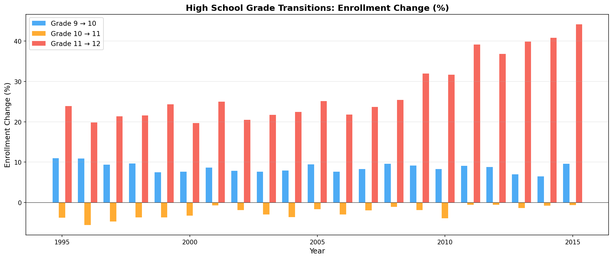
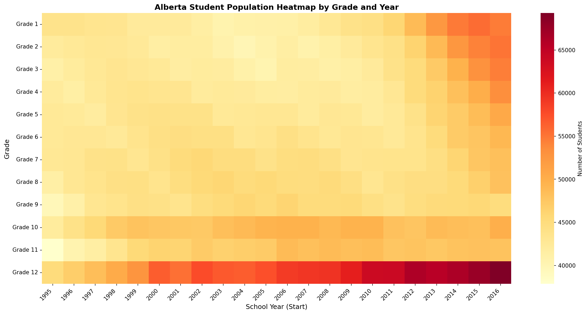
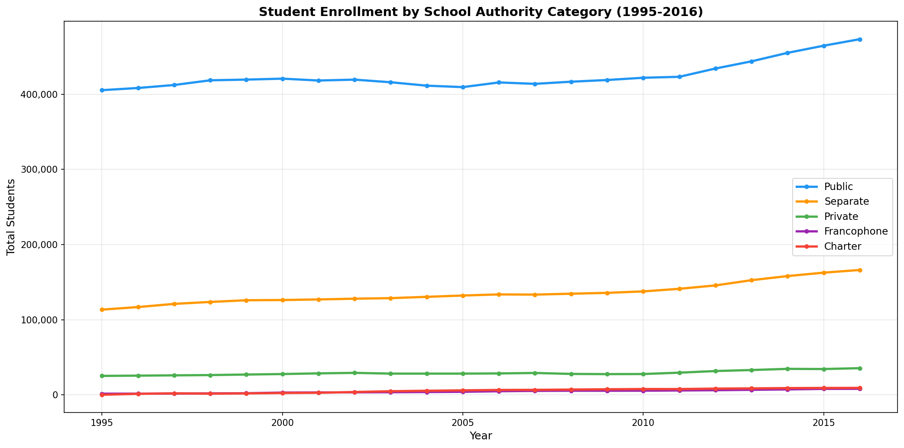
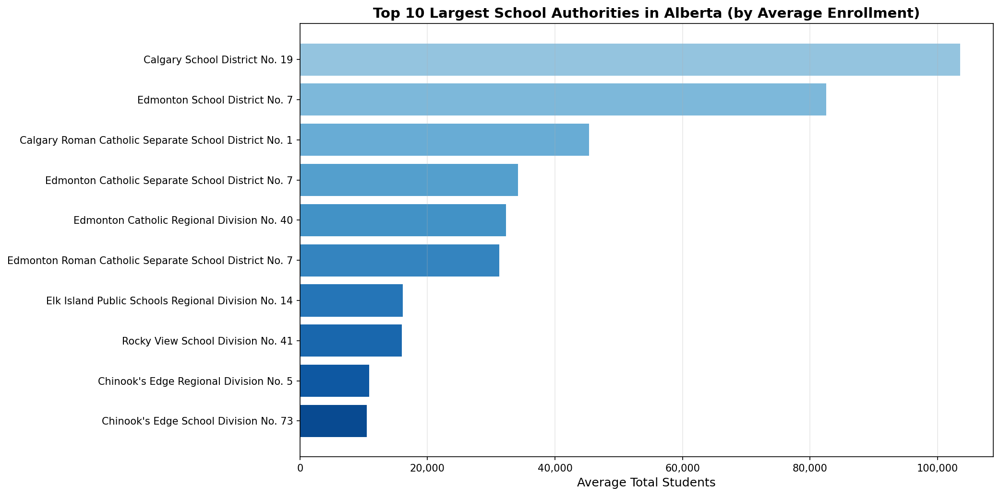

# Alberta Schools Dropout Analysis

**GeoWomenYYC -- June 2021 Datathon -- Team 1**

An exploratory data analysis of Alberta school enrollment patterns, focusing on dropout rates, grade transitions, and school authority changes across the province from 1995 to 2016.

See also: [GeoWomenYYC Datathon 2021 main repository](https://github.com/csrina/geowoman_datathon_2021)

---

## Table of Contents

- [About the Datathon](#about-the-datathon)
- [Research Questions](#research-questions)
- [Data Sources](#data-sources)
- [Key Findings](#key-findings)
- [Visualizations](#visualizations)
- [Repository Structure](#repository-structure)
- [How to Reproduce](#how-to-reproduce)
- [License](#license)

---

## About the Datathon

[GeoWomenYYC](https://www.meetup.com/GeoWomenYYC/) is a Calgary-based community group that brings together women interested in geospatial data and analytics. In June 2021, they organized a datathon where participants formed teams to analyze open data from Alberta.

**Team 1** chose to investigate student dropout patterns in Alberta's K-12 education system, asking whether there are meaningful dropout rates at specific grades and what indicators might predict them.

---

## Research Questions

1. **What is the percentage of dropout rates per municipality?**
2. **Is the dropout rate related to class sizes?**
3. **Is it related to income level?**
4. **Do we have data to relate this to facility conditions?**

---

## Data Sources

All data is sourced from the [Alberta Open Data Portal](https://open.alberta.ca/):

| Dataset | File | Records | Description |
|---------|------|---------|-------------|
| [School & Authority Student Population](https://open.alberta.ca/opendata/alberta-school-and-school-authority-student-population) | `alberta-school-student-population-data.csv` | 46,151 rows | Per-school enrollment by grade, 1995-2016 |
| [Authority Student Population](https://open.alberta.ca/opendata/alberta-school-and-school-authority-student-population) | `alberta-school-authority-student-population-data.csv` / `authority-student-population-data.csv` | 7,226 rows | Enrollment aggregated by school authority |
| [Class Size by School Year](https://open.alberta.ca/opendata/class-size-by-school-year-jurisdiction-and-grade-alberta) | `csis_2004_2018.zip` | Combined 2004-2018 | Class sizes by jurisdiction, grade, and subject |

Additional data sources identified for future exploration:
- [Employment Rate (Alberta Regional Dashboard)](https://regionaldashboard.alberta.ca/#/explore-an-indicator?i=employment-rate&d=CalculatedValue)
- [Median Family Income (Alberta Regional Dashboard)](https://regionaldashboard.alberta.ca/#/explore-an-indicator?i=median-family-income&d=CalculatedValue)
- [Internet Access across Canada](https://open.alberta.ca/dataset/proportion-of-households-with-access-to-the-internet-for-canada-alberta-economic-regions-2010/resource/68e00a17-0f92-4da3-a774-6f585c2c5754)

---

## Key Findings

### 1. School Authority Changes Are Negligible

Schools occasionally transfer between school authorities (districts), but this has become increasingly rare over time. In 1997 and 1998, over 100 schools changed authority in a single year, but by 2016 this dropped to just 1 school. The total number of schools in Alberta grew slowly at approximately **0.4% per year**, from about 2,047 in 1996 to 2,225 in 2016.

### 2. Enrollment Change Varies Significantly by Grade

- **Grades 1-7** show relatively small year-over-year changes, typically within +/- 2%.
- **Grade 1** consistently shows a slight negative change (~-2%), likely reflecting variation in incoming cohort sizes rather than true dropout.
- **Grade 9 to 10** shows a consistent **positive surge of ~8-10%**, suggesting an influx of students entering the high school system (possibly from other provinces, private schools, or returning students).
- **Grade 10 to 11** shows a consistent **negative drop of ~3-5%**, indicating real attrition at this critical transition point.
- **Grade 11 to 12** shows a **large positive change (15-25%)** that has been increasing over time, possibly due to students taking an extra year to complete Grade 12 or returning to school.

### 3. Enrollment Changes Are Not Purely Dropout

The analysis reveals that enrollment changes between grades are not solely attributable to dropouts. They also reflect:
- Students repeating grades (contributing to positive changes)
- Students transferring in from outside the province
- Students entering or leaving private/home schooling
- Demographic shifts in birth rates

### 4. Notable Anomalies

- **2005** and **2011-2012** saw an influx of students across all grades, possibly related to economic factors (Alberta's oil boom attracting families to the province).
- The Grade 11 enrollment change has been increasing steadily over the study period, warranting further investigation.

---

## Visualizations

### Total Student Population Over Time

Alberta's total K-12 student population from 1995 to 2016, showing steady growth driven by population increases and immigration to the province.



### School Authority Changes

The number and percentage of schools that changed their governing authority each year. Authority transfers have become increasingly rare over time.



### Year-over-Year Enrollment Change by Grade

Tracking the percentage change in enrollment from one grade to the next grade in the following year. Grades 1-7 show relatively stable patterns, while high school grades show dramatic swings.



### Distribution of Enrollment Changes (Box Plot)

A summary of the enrollment change distributions across all years for each grade. The box plot clearly shows that Grade 9 and Grade 11 are outliers with large positive medians, while Grade 10 consistently shows negative changes.



### High School Grade Transitions

A focused view on the critical high school transitions (Grades 9-10, 10-11, and 11-12), which exhibit the most dramatic enrollment changes.



### Student Population Heatmap by Grade and Year

A heatmap showing enrollment counts across all grades and years, revealing how cohorts flow through the system.



### Enrollment by School Authority Category

Tracking enrollment trends across different school authority types: Public, Separate (Catholic), Private, Francophone, and Charter schools.



### Top 10 Largest School Authorities

The largest school authorities in Alberta by average student enrollment over the study period.



---

## Repository Structure

```
alberta_schools_dropout/
├── 2021_06_05.ipynb                                  # Main Jupyter notebook with analysis
├── alberta-school-student-population-data.csv         # Per-school enrollment data (1995-2016)
├── alberta-school-authority-student-population-data.csv  # Authority-level enrollment data
├── authority-student-population-data.csv              # Authority population data (duplicate)
├── csis_2004_2018.zip                                 # Class size data (2004-2018)
├── images/                                            # Generated visualizations
│   ├── 01_authority_changes.png
│   ├── 02_enrollment_change_by_grade.png
│   ├── 03_enrollment_change_boxplot.png
│   ├── 04_total_population_over_time.png
│   ├── 05_population_heatmap.png
│   ├── 06_enrollment_by_authority_category.png
│   ├── 07_high_school_transitions.png
│   └── 08_top_authorities.png
├── LICENSE                                            # GPL-3.0
└── README.md                                          # This file
```

---

## How to Reproduce

### Prerequisites

- Python 3.8+
- Required packages:

```bash
pip install pandas numpy matplotlib seaborn jupyter
```

### Running the Analysis

1. **Clone the repository:**
   ```bash
   git clone https://github.com/k1monfared/alberta_schools_dropout.git
   cd alberta_schools_dropout
   ```

2. **Extract the class size data (optional, needed for class size analysis):**
   ```bash
   unzip csis_2004_2018.zip
   ```

3. **Launch the notebook:**
   ```bash
   jupyter notebook 2021_06_05.ipynb
   ```

4. **Run all cells** to reproduce the analysis and visualizations.

### Data Notes

- The school student population CSV uses `latin-1` encoding (contains accented characters in French school names).
- The class size data (`csis_2004_2018.zip`) contains a combined CSV of yearly class size reports from 2004 to 2018.
- The `grade` field in the class size data is inconsistently formatted (e.g., `01`, `001`, `01/02/03`) and requires cleaning for grade-level analysis.
- Some rows at the end of `alberta-school-student-population-data.csv` contain a footnote about First Nations data being removed for privacy reasons.

---

## License

This project is licensed under the [GNU General Public License v3.0](LICENSE).
